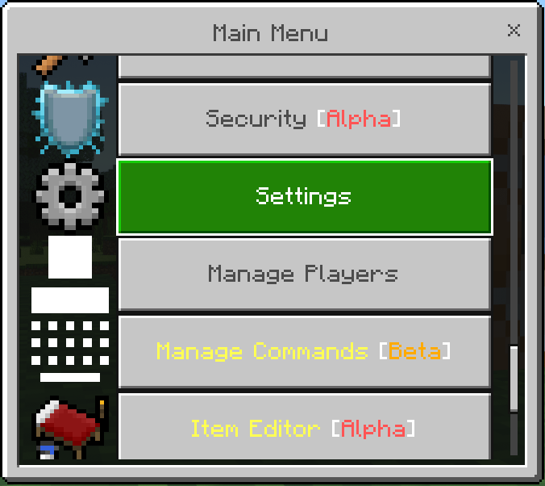
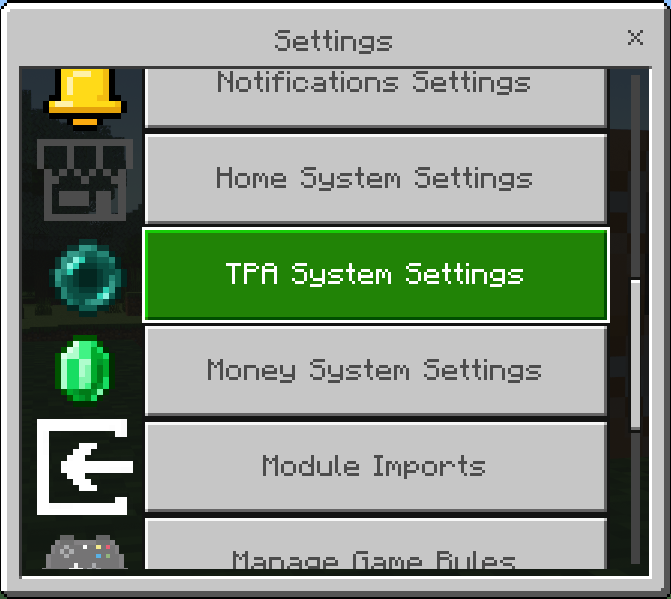
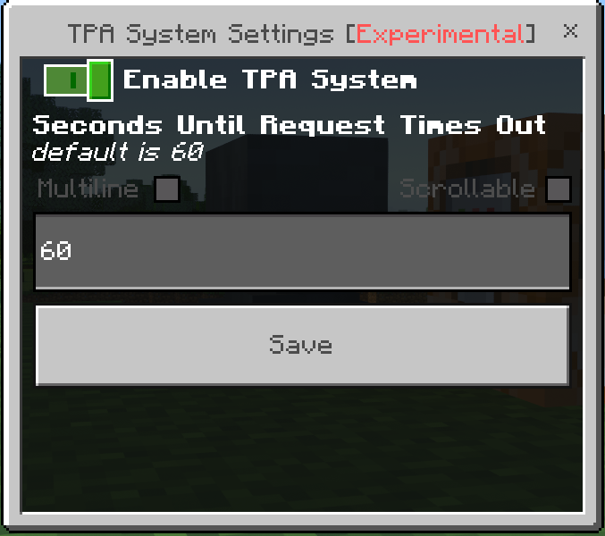
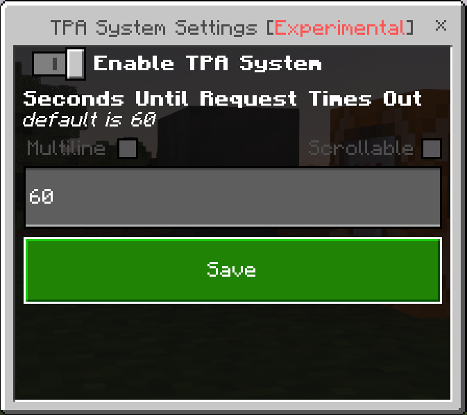

Any player can use the TP request system, regardless of permissions. The TP request system is disabled by default, so make sure to turn it on in settings.

## How to enable the TPA system

1. Open the [Main Menu](../main-menu/main-menu) (use the [`\mainmenu`{lang=acmd}](../commands-list/-mainmenu.md) command or the [Main Menu stick](../general/items#Main-Menu)).
2. Scroll down and click "Settings".

    

3. Scroll down and click "TPA System Settings".

    

4. Enable the [`Enable TPA System`](../settings/tpa-system#enable-tpa-system) toggle.

    

5. Click the "Save" button.

    

## How to use the TPA/teleport request system

-   Use `\tpa <player: target>`{lang=acmd} to request to teleport to a player (ex. ` `{lang=mcfunction noRightCodeBlock=true}[`\tpa`{lang=mcfunction noLeftCodeBlock=true noRightCodeBlock=true}](../commands-list/-tpa) `Andexter8`{lang=mcfunction noLeftCodeBlock=true} or ` `{lang=mcfunction noRightCodeBlock=true}[`\tpa`{lang=mcfunction noLeftCodeBlock=true noRightCodeBlock=true}](../commands-list/-tpa) `@r`{lang=mcfunction noLeftCodeBlock=true}). This will send a message to that player. If they type `n` in chat or do nothing for 1 minute, the request will be denied. If they type `y` in chat, you will be teleported to them.
-   You can configure a [PVP cooldown](../settings/general#pvp-cooldown) in settings, this will cause the players to be unable to use any of the teleport commands (ex. [`\tpa`{lang=acmd}](../commands-list/-tpa), [`\spawn`{lang=acmd}](../commands-list/-spawn), and [`\home`{lang=acmd}](../commands-list/-home)) for the specified amount of time after they are hit by another player.
